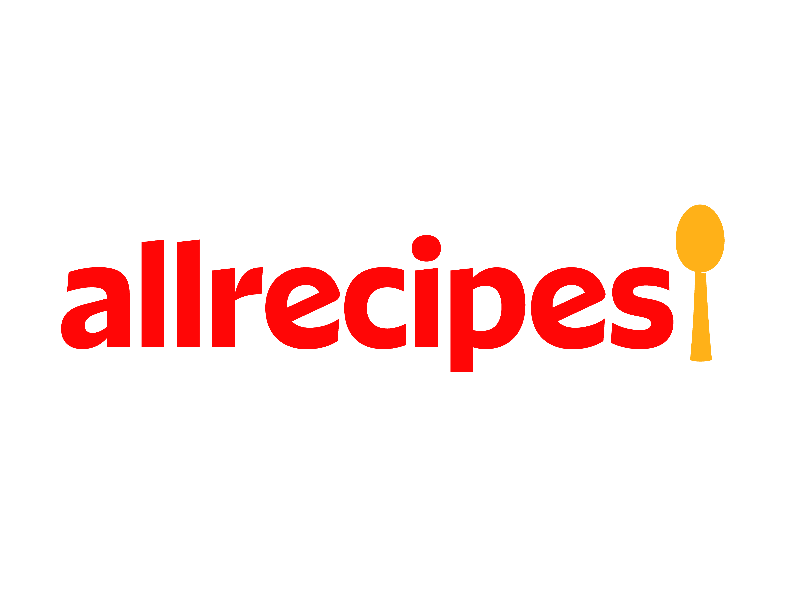

  

# King Crab Appetizers 🦀

Welcome to King Crab Appetizers, your gateway to the exquisite world of gourmet cooking! Developed as part of Module One in your Full Stack Development course, this static website project brings you an authentic recipe for King Crab Appetizers. Crafted with HTML and CSS, this clone of Allrecipes.com's famous recipe page captures the essence of culinary excellence with precision.

Explore the live website: [King Crab Appetizers](https://king-crab-appetizers.netlify.app/)

## Dive into Culinary Majesty 🌟

King Crab Appetizers isn't just a clone; it's a culinary masterpiece! With a real recipe for King Crab Appetizers at its core, this project invites you to indulge in the rich flavors and textures of this gourmet delight.

## Features 🍽️

- **Real Recipe**: Experience the authentic taste of King Crab with a genuine recipe.
- **Visual Delight**: Immerse yourself in a visually stunning recreation of the Allrecipes.com page.
- **Static Web Mastery**: Showcase your skills in static web development with precise HTML and CSS craftsmanship.

## Technologies Used 💻

- HTML
- CSS (Inline)

## Deployment 🚀

Indulge your taste buds and visit [King Crab Appetizers](https://king-crab-appetizers.netlify.app/) now! Hosted on Netlify, this website is your passport to culinary excellence.

## Contribution 🤝

Hungry for more? Contribute to King Crab Appetizers by enhancing its design, adding new features, or sharing your own culinary creations. Fork the repository, and let your creativity shine!

## License 📄

This project is licensed under the [MIT License](LICENSE). Feel free to savor its code and use it to create your own culinary masterpieces!
